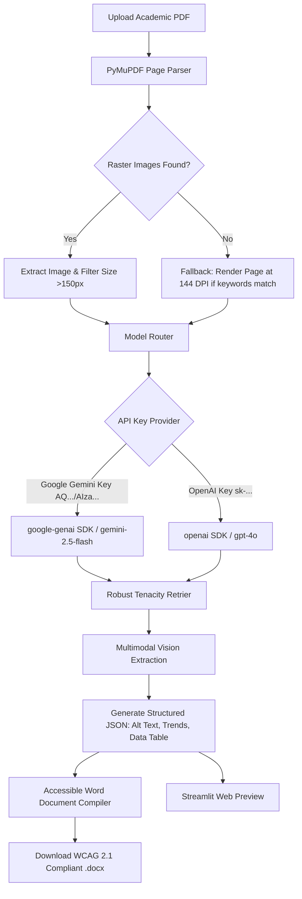

# Chart Verbalizer: PDF Academic Chart Accessibility Translator

**Chart Verbalizer** is an automated accessibility engineering pipeline designed to bridge the representation gap for screen reader users (e.g., NVDA, JAWS, VoiceOver) interacting with academic publications. 

Standard screen readers rely on linear OCR for unstructured images, failing to decode complex charts, plots, and figures. Inspired by research in multimodal representations and digital inclusion—specifically the pioneering work on visual accessibility at UIUC iSchool's (x)Ability Design Lab—this project reconstructs academic charts into semantic, structural representations.

---

## System Architecture



---

## Key Features

1. **Vector Graphics Rasterization Fallback**: Academic papers (compiled via R, ggplot2, or LaTeX) typically store figures as vector paths rather than embedded bitmap files. The pipeline detects if a page contains keywords (e.g., `Figure`, `scatterplot`, `histogram`, etc.) but lacks raster images, and automatically renders the target page at `144 DPI` to ensure fine chart features are preserved.
2. **API Model Router**: Dynamically routing between **Google Gemini API** (using the new `AQ.` standard keys on the highly responsive and cost-effective `gemini-flash-latest` model) and **OpenAI API** (`gpt-4o`) based on the provided credentials.
3. **Structured Table Reconstruction**: Leverages VLM JSON schemas to transform visual data points into multidimensional structured arrays, ensuring table columns and rows match perfectly.
4. **Transient Error Resilience**: Configured with `tenacity` exponential backoff retries (up to 5 attempts, maximum 44 seconds wait time) to smoothly mitigate transient network drops, rate limits (HTTP 429), or model demand surges (HTTP 503).
5. **Accessible Document Compilation**: Embeds the figure together with its Alt Text tag, trend summaries, and a native Word table that conforms to WCAG 2.1 table-parsing standards for screen readers.

---

## Installation & Setup

Ensure you have Python 3.10+ installed.

### 1. Local Setup
Clone the repository and install the dependencies:
```bash
git clone <your-repo-url>
cd chart_verbalizer

# Create a virtual environment
python3 -m venv .venv
source .venv/bin/activate  # On Windows use: .venv\Scripts\activate

# Install dependencies
pip install -r requirements.txt
```

### 2. Configure Credentials
Create a `.env` file in the root folder and add your OpenAI or Gemini key:
```env
OPENAI_API_KEY="your-api-key"
```
*(Note: Google Gemini keys starting with `AQ.` or `AIza...` are fully supported under the `OPENAI_API_KEY` configuration name for seamless fallback compatibility).*

---

## Usage

Run the local interactive worktable using Streamlit:
```bash
streamlit run app.py
```
Open [http://localhost:8501](http://localhost:8501) in your browser.

---

## Streamlit Cloud Deployment

You can deploy this dashboard for free to Streamlit Cloud for quick viewing by admissions teams or research advisors:

1. Push this codebase to a public GitHub repository.
2. Visit [share.streamlit.io](https://share.streamlit.io/) and log in using your GitHub account.
3. Click **"New App"**, choose your repository and branch, and specify `app.py` as the entrypoint.
4. Open **Settings -> Advanced Settings -> Secrets** and paste your API Key:
   ```toml
   OPENAI_API_KEY = "your-api-key-here"
   ```
5. Click **Deploy**. Your app will be live on a public URL in minutes.
